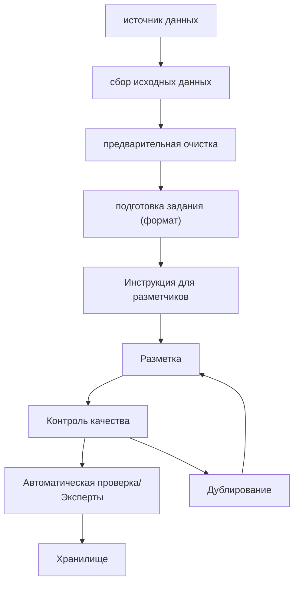

### Источники данных:
- сайты
- соц. сети
- каналы (текст, подкасты, видео)
- CRM, ERP. MES
- Опросы
- Изображения, галереи
- Промышленные датчики

### Сбор исходных данных:
- Data Lake / RAM (если данных мало, а оперативы много)
- Объём / Скорость загрузки
- Челлендж для Data Engineer

### Предварительная очистка:
- Удаляем:
	- Дубликаты
	- Пропуски
	- Технические данные
	- Спам, шум, выбросы и очистки

### Подготовка задания:
- Формат результата
- Формируем задачу
- Приводим к нужному формату
### Инструкция для разметки:
- Цель: зачем делать разметку?
- Объект: что размечаем? Особенности формата входа.
- Результат. Формат выхода.

### Правило при