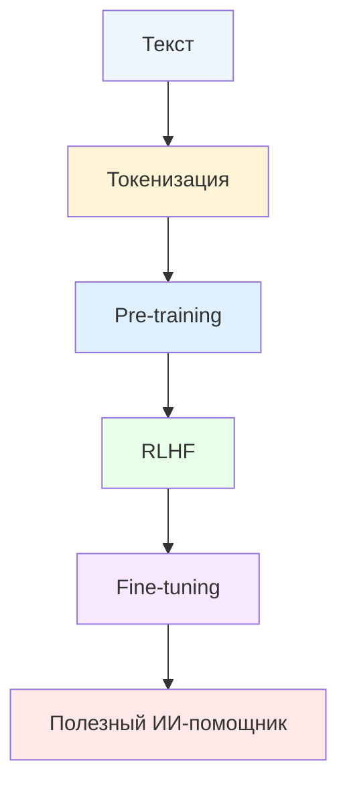

# <font color="#9F3ED5">Эволюция архитектур нейронных сетей: от RNN к Transformer</font>

## Основные определения

### NLP (Natural Language Processing)
Обработка естественного языка — область искусственного интеллекта, занимающаяся тем, как машины читают, понимают и извлекают смысл из человеческого языка.

### RNN (Recurrent Neural Networks)
Рекуррентные нейронные сети — модели для обработки последовательностей, где текущий шаг зависит от предыдущего состояния.

Используются для:
- текста
- речи
- временных рядов
- последовательных данных

### CNN (Convolutional Neural Networks)
Свёрточные нейронные сети — архитектуры для данных с пространственной структурой.

Применяются для:
- изображений
- видео
- компьютерного зрения

Факты:
- идея предложена Яном Лекуном в 1988 году
- широкая известность после победы AlexNet на ImageNet  в 2012 году

---

## Общая идея эволюции

Переход от RNN к Transformer — это переход:

**от последовательной обработки → к параллельному вниманию**

Главная задача: научить компьютер понимать последовательности слов и смысл текста.

---

## Эпоха RNN

## Как работают RNN

Обрабатывают текст по словам:

`Кот → сидит → на → коврике`

На каждом шаге сеть:
- получает новое слово
- использует память о предыдущих словах
- обновляет внутреннее состояние

## Преимущества RNN

- естественно работают с последовательностями
- могут учитывать прошлый контекст
- подходят для текстов разной длины

## Недостатки RNN

### 1. Исчезающий градиент

Чем длиннее последовательность, тем хуже сеть помнит начало текста.

Пример:

> Девочка ... была очень умной

К слову **была** модель могла забыть слово **девочка**.

### 2. Медленная работа

Нельзя обработать следующее слово, пока не обработано предыдущее.

`Я → хочу → съесть → яблоко`

### 3. Долгосрочные зависимости

Сложно связывать слова, которые далеко друг от друга.

Пример:

> Я родился в России ... Сегодня говорю на русском языке

---

## Улучшение RNN: LSTM и GRU

## LSTM (Long Short-Term Memory)

Добавлены специальные ворота памяти:

- **Forget gate** — что забыть
- **Input gate** — что запомнить
- **Output gate** — что использовать сейчас

## Преимущества

Лучше сохраняют важную информацию на длинных последовательностях.

## Но проблемы остались

- последовательная обработка
- сложность обучения
- слабая параллелизация

---

## Революция: Transformer

Главная идея:

> Обрабатывать все слова одновременно.

Вместо чтения по одному слову модель видит всю фразу сразу.

---

## Attention (механизм внимания)

Позволяет определить, какие слова важны друг для друга.

Пример:

> Красивая кошка спит на мягкой подушке

Для слова **кошка** внимание может быть:

- красивая → высокое
- спит → очень высокое
- подушке → высокое
- на → низкое

---

## Self-Attention

Слова анализируют связи между собой.

Пример:

> Собака гналась за кошкой, но она убежала

Self-attention помогает понять:

- **она** = кошка
- **гналась** связано с собакой
- **убежала** связано с кошкой

---

## Multi-Head Attention

Несколько механизмов внимания работают параллельно.

Каждая "голова" анализирует своё:

- грамматику
- смысл
- стиль
- связи между словами

Пример:

> Старый мудрый профессор читал лекцию

Одна голова ищет определения, другая действия, третья стиль.

---

## Преимущества Transformer над RNN

## 1. Параллельная обработка

RNN:

`Я → люблю → читать → книги`

Transformer:

`[Я, люблю, читать, книги]`

Все слова одновременно.

## 2. Долгий контекст

Легко связывает начало и конец текста.

## 3. Масштабируемость

Хорошо обучается на огромных данных.

Примеры моделей:
- GPT-3
- GPT-4

## 4. Интерпретируемость

Можно визуализировать attention-веса и понимать, куда смотрит модель.

---

## Практические результаты

## Улучшение качества

- машинный перевод: ~70% → 95%+
- генерация текста: от простых фраз до статей
- понимание контекста и логики

## Скорость обучения

- RNN: недели
- Transformer: дни при лучшем качестве

---

## Современные модели на основе Transformer

- GPT
- BERT
- T5
- ChatGPT
- Claude
- GigaChat

---

## Краткий вывод

RNN читали текст **слово за словом**.  
Transformer анализирует **весь текст сразу**.

Именно переход к Transformer стал основой современной революции в искусственном интеллекте.


# <font color="#9F3ED5">Архитектура Transformer</font>

## Общая идея

Архитектура **Transformer** произвела революцию в обработке последовательностей, заменив рекуррентные и свёрточные слои механизмами внимания и позиционного кодирования.

Ключевые особенности:

- параллельная обработка данных;
- эффективное моделирование контекста;
- работа с последовательностями без RNN и CNN.

---

## Упрощённая схема Transformer

```mermaid
flowchart LR
    A["INPUT<br/>Je suis étudiant"] --> B

    subgraph T["Transformer"]
        direction LR
        B["ENCODERS"]
        C["DECODERS"]
        B --> C
    end

    C --> D["OUTPUT<br/>I am a student"]

    style T fill:#f5f5f5,stroke:#2f6df6,stroke-width:3px,color:#000
    style B fill:#dfe9da,stroke:#666,stroke-width:2px
    style C fill:#eadbe5,stroke:#666,stroke-width:2px
    style A fill:#eef8ea,stroke:#7abf6a,stroke-width:2px
    style D fill:#f4e8ff,stroke:#b88be0,stroke-width:2px
````

---

## Более детальная структура

```mermaid
flowchart LR

subgraph E["ENCODER"]
direction TB
E1["Self-Attention"]
E2["Add & Normalize"]
E3["Feed Forward"]
E4["Add & Normalize"]
E1 --> E2 --> E3 --> E4
end

subgraph D["DECODER"]
direction TB
D1["Self-Attention"]
D2["Add & Normalize"]
D3["Encoder-Decoder Attention"]
D4["Add & Normalize"]
D5["Feed Forward"]
D6["Add & Normalize"]
D7["Linear"]
D8["Softmax"]

D1 --> D2 --> D3 --> D4 --> D5 --> D6 --> D7 --> D8
end

E --> D3

style E fill:#eef7ea,stroke:#7aa86d,stroke-width:2px
style D fill:#fff1f7,stroke:#e59ac0,stroke-width:2px

style E1 fill:#f5e7d7,stroke:#777
style E2 fill:#e5f0c8,stroke:#777
style E3 fill:#e9f1ff,stroke:#777
style E4 fill:#e5f0c8,stroke:#777

style D1 fill:#f5e7d7,stroke:#777
style D2 fill:#e5f0c8,stroke:#777
style D3 fill:#f5e7d7,stroke:#777
style D4 fill:#e5f0c8,stroke:#777
style D5 fill:#e9f1ff,stroke:#777
style D6 fill:#e5f0c8,stroke:#777
style D7 fill:#efe7ff,stroke:#777
style D8 fill:#f8d8d8,stroke:#777
```

---

## Аналогия с анализом документа

1. **Эмбеддинги** — превращаем слова в числа.
2. **Self-Attention** — находим связи между частями документа.
3. **Add & Normalize** — стабилизируем обучение.
4. **Feed Forward** — дополнительная обработка каждого слова.
5. **Add & Normalize** — финальная стабилизация.

---

## Как понимать Transformer

Transformer можно представить как универсальный «мозг» для работы с языком:

- **Attention** — способность фокусироваться на важном;
- **Позиционное кодирование** — понимание порядка слов;
- **Многослойность** — глубина понимания;
- **Остаточные связи** — стабильность обучения.

---

## Вывод

Архитектура Transformer сложнее, чем упрощённые схемы, но её ключевая сила — эффективная работа с контекстом и последовательностями.

Даже с возможными ошибками модель Transformer показывает результаты лучше RNN.


# <font color="#9F3ED5">Обучение LLM: путь от младенца до эксперта</font>

## Общая идея

Знания архитектуры модели недостаточно для её практического использования. Важно понимать, **как обучаются LLM**, чтобы разобраться, как обычная языковая модель становится полезным помощником.

Обучение LLM можно представить как развитие человека:

- 🍼 **Рождение (Инициализация)** — случайные веса нейросети  
- 📚 **Школа (Pre-training)** — изучение языка из интернета  
- 🎓 **Университет (RLHF)** — обучение быть помощником  
- 💼 **Специализация (Fine-tuning)** — освоение конкретных задач  

---

## 1. Токенизация контента

### Что такое токенизация

Токенизация — это разбиение текста на части (**токены**), которые модель может обрабатывать.

Аналогия: разбор конструктора LEGO на отдельные детали.

Пример текста:

> Привет, как дела?

---

### Виды токенизации

#### Токенизация на уровне слов

```text
["Привет", ",", "как", "дела", "?"]
````

#### Субсловная токенизация (BPE)

```text
["При", "вет", ",", "как", "де", "ла", "?"]
```

#### Токенизация на уровне символов

```text
["П","р","и","в","е","т",","," ","к","а","к"," ","д","е","л","а","?"]
```

---

### Почему субсловная токенизация важна

Пример слова:

```text
ChatGPT
```

#### Словарная токенизация

```text
[UNK]
```

#### Субсловная токенизация

```text
["Chat", "GPT"]
```

Это позволяет понимать новые и редкие слова.

---

### Как создаётся словарь токенов

1. Собирается большой корпус текстов
    
2. Выделяются частые символы
    
3. Выделяются частые пары символов
    
4. Формируется словарь размером около **50 000 токенов**
    

---

## 2. Pre-training — изучение языка

### Общая идея

Модель обучается как ребёнок, который учится говорить:

- слышит миллионы предложений;
    
- пытается угадать следующее слово;
    
- учится на ошибках.
    

LLM:

- читает триллионы слов;
    
- предсказывает следующий токен;
    
- улучшает веса через обратное распространение ошибки.
    

---

### Источники данных

Для предобучения используются:

- новости;
    
- книги;
    
- веб-страницы;
    
- Википедия;
    
- форумы;
    
- научные статьи;
    
- социальные сети.
    

Пример:

Для GPT-3 использовали **500 миллиардов токенов**.

---

### Ограничение pre-training

После предобучения модель понимает язык, но ещё не является хорошим помощником.

Пример:

**Пользователь:** Как приготовить борщ?

**Модель:** начинает писать длинную статью вместо прямого ответа.

---

## 3. RLHF — обучение быть помощником

**RLHF (Reinforcement Learning from Human Feedback)** — обучение с использованием обратной связи от людей.

---

### Этап 1. Supervised Fine-Tuning (SFT)

Модель обучают на хороших примерах ответов.

#### Пример

**Вопрос:** Объясни квантовую физику

**Хороший ответ:** краткое понятное объяснение.

---

**Вопрос:** Как взломать компьютер?

**Хороший ответ:** отказ + безопасная альтернатива.

---

### Этап 2. Обучение модели награды

Создаётся модель, которая оценивает качество ответов.

#### Пример

**Вопрос:** Как похудеть?

- Ответ A: Ешьте только воздух → 1/10
    
- Ответ B: Диета и упражнения → 9/10
    

---

### Этап 3. Reinforcement Learning (PPO)

Модель получает награду за хорошие ответы.

Процесс:

1. Генерирует ответ
    
2. Reward-модель оценивает
    
3. Высокая оценка → закрепление поведения
    
4. Низкая оценка → корректировка
    

---

### Результат RLHF

До RLHF:

**Как приготовить борщ?** → длинная энциклопедическая статья

После RLHF:

**Как приготовить борщ?** → чёткий пошаговый рецепт

---

## Альтернатива RLHF — Constitutional AI

Вместо людей модели задают набор принципов.

### Примеры принципов

- Будь полезным и честным
    
- Не причиняй вреда
    
- Уважай выбор человека
    
- Будь беспристрастным
    

### Самооценка модели

- Полезен ли ответ?
    
- Может ли навредить?
    
- Уважает ли пользователя?
    

---

## 4. Fine-tuning — специализация

После обучения быть помощником модель можно сделать специалистом.

---

### Типы Fine-tuning

## 4.1 Task-specific Fine-tuning

Обучение под конкретную профессию или задачу.

### Примеры

- Медицинская модель
    
- Юридическая модель
    

---

## 4.2 Instruction Tuning

Обучение следованию инструкциям.

### Примеры

- Переведи текст
    
- Суммируй статью
    
- Реши уравнение
    

---

## 4.3 Domain Adaptation

Адаптация под предметную область.

### Примеры

- Финансы
    
- Медицина
    

---

## 4.4 LoRA (Low-Rank Adaptation)

Позволяет адаптировать модель без переобучения всех параметров.

### Принцип работы

- базовые веса замораживаются;
    
- добавляются маленькие обучаемые матрицы;
    
- модель получает новую специализацию.
    

### Аналогия

Большая книга + маленький буклет с обновлениями.

### Пример

- Оригинальная модель: 175 млрд параметров
    
- LoRA адаптер: 1 млн параметров
    

---

## Проблема Fine-tuning: Catastrophic Forgetting

Сильная специализация может ухудшить общие знания.

### Пример

До обучения:

- Кто написал «Войну и мир»? → Лев Толстой
    
- Что такое Python? → язык программирования
    

После агрессивного программного fine-tuning:

- Кто написал «Войну и мир»? → не знаю
    
- Что такое Python? → помнит
    

---

### Решения проблемы

- **Regularization** — не давать модели сильно изменяться
    
- **Curriculum Learning** — постепенное обучение
    
- **Multi-task Learning** — обучение на нескольких задачах
    

---

## Современные тренды обучения LLM

### Multimodal Training

Тексты + изображения + аудио.

### RLAIF

Reinforcement Learning from AI Feedback — ИИ оценивает ответы вместо человека.

### Constitutional AI

Самооценка модели по принципам.

### Mixture of Experts (MoE)

Разные эксперты для разных типов задач.

---

## Полная схема обучения LLM



---

## Краткий вывод

Создание современной LLM — это многоэтапный процесс:

1. **Токенизация** — превращение текста в числа
    
2. **Pre-training** — изучение языка
    
3. **RLHF** — обучение полезному поведению
    
4. **Fine-tuning** — специализация
    

Каждый этап критически важен для создания эффективного и безопасного ИИ-помощника.