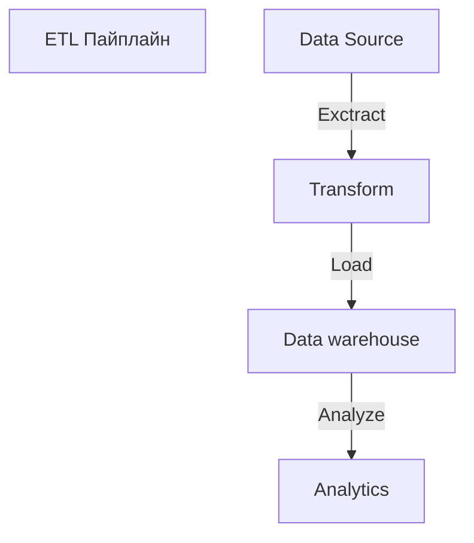

### Устройство ПК

```mermaid
flowchart TD
	O["ETL Пайплайн"]
    A["Data Source"] -->|Exctract| B["Transform"]
    B["Transform"] -->|Load| C["Data warehouse"]
    C["Data warehouse"] -->|Analyze| D["Analytics"]
```
Работа CPU & RAM
Хранение данных в памяти
Стек вызовов
Объекты в Python
Адреса и карты памяти
Типизация и сборка мусора в Python