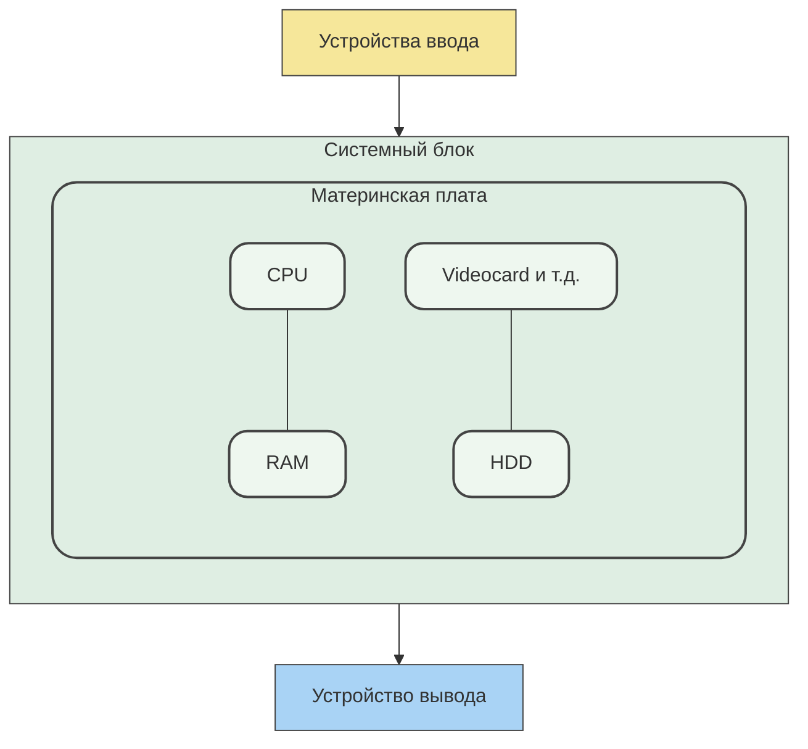
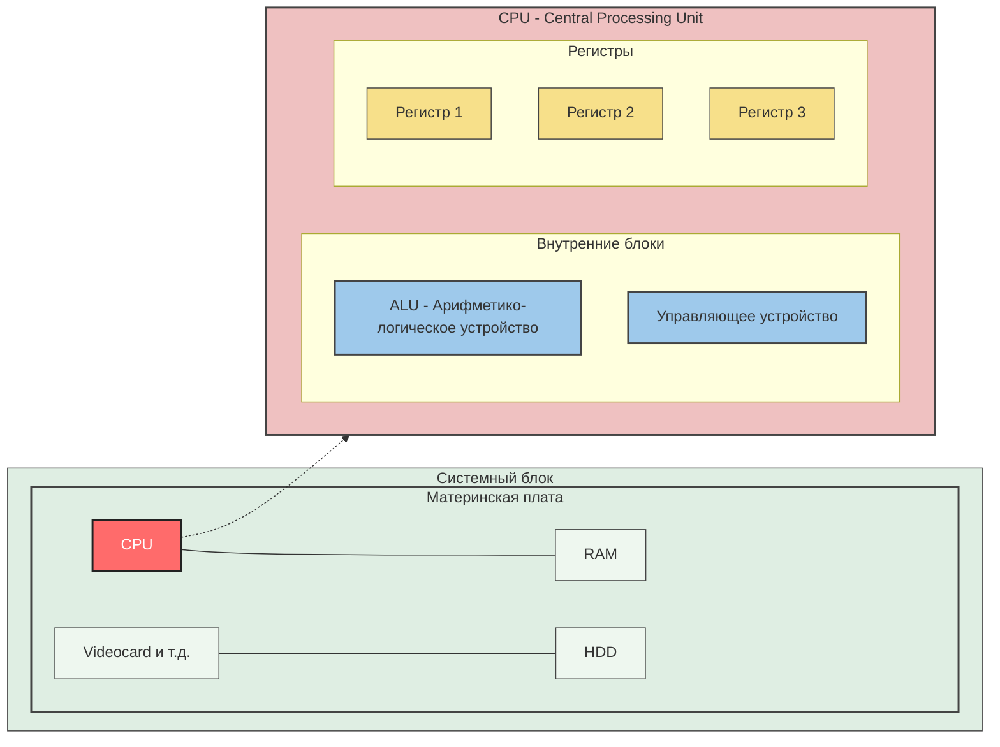

### Устройство ПК

 - CPU - повар, RAM - рабочий стол повара, HDD - склад для повара
- Примеры команд, которые поддерживает процессор:
1. MOV - Загружает данные из RAM
2. DIV - Делит
3. SUM - Сумма
4. INC - Увеличивает на единицу
5. XOR - какая-то логическая команда...
6. AND - Логическая И
7. OR - Логическая ИЛИ
- Все действия сводятся к базовым операциям ↑, а базовые операции сводятся к работе с нулями и единицами
### Работа CPU & RAM

RAM:
1. Энергозависимая
2) Быстрый и эффективный рандомный доступ
3) Дорогая (по сравнению с HDD) => малый объем

SSD, HDD:
1) Медленная память
2) Последовательный доступ*
3) Не зависит от энергии
4) Дешевая => большой объем

Оперативную память удобно представить в виде таблицы:

|      | 7   | 6   | 5   | 4   | 3   | 2   | 1   | 0   |
| ---- | --- | --- | --- | --- | --- | --- | --- | --- |
| 0x0  |     |     |     |     |     |     |     |     |
| 0x8  |     |     |     |     |     |     |     |     |
| 0x16 |     |     |     |     |     |     |     |     |
| 0x24 |     |     |     |     |     |     |     |     |

- ALU - набор устройств на процессоре, способных выполнять логические команды.
- Управляющее устройство - преобразует команды из RAM в команды для ALU.
- Регистр - небольшой набор ячеек памяти.
- Значения в ячейках памяти = адреса каких-то ячеек памяти
### Хранение данных в памяти
- Кодировка - набор правил, по которому происходит шифрование/кодирование символов в двоичный код
- Массивы (Листы) - последовательно выделенная область памяти.

Стек вызовов
Объекты в Python
Адреса и карты памяти
Типизация и сборка мусора в Python
