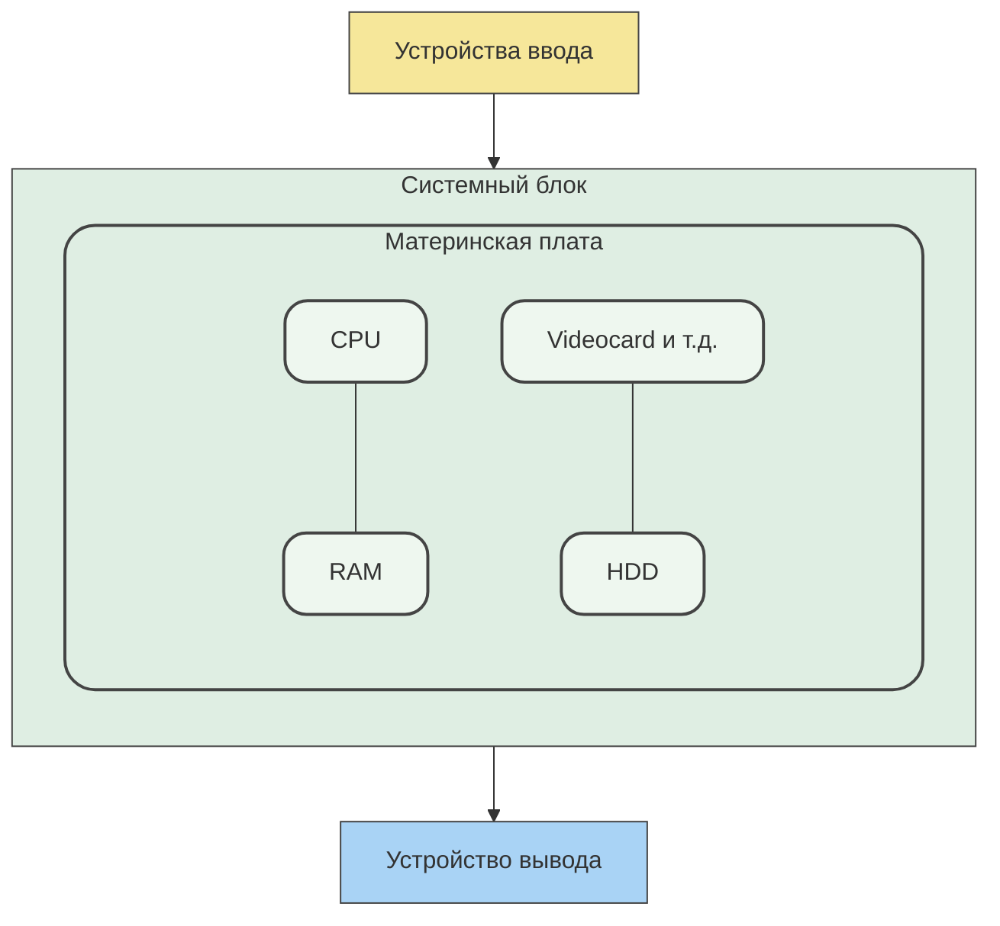

### Устройство ПК

 - CPU - повар, RAM - рабочий стол повара, HDD - склад для повара
- Примеры команд, которые поддерживает процессор:
1. MOV - Загружает данные из RAM
2. DIV - Делит
3. SUM - Сумма
4. INC - Увеличивает на единицу
5. XOR - какая-то логическая команда...
6. AND - Логическая И
7. OR - Логическая ИЛИ

Работа CPU & RAM
Хранение данных в памяти
Стек вызовов
Объекты в Python
Адреса и карты памяти
Типизация и сборка мусора в Python